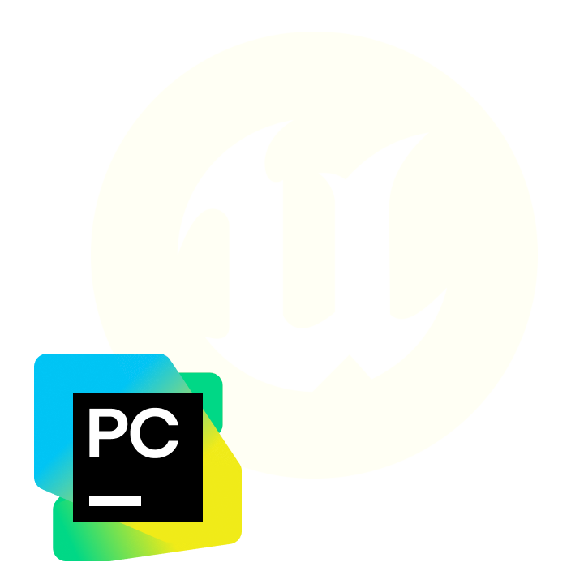
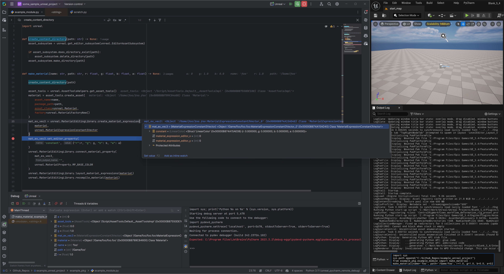
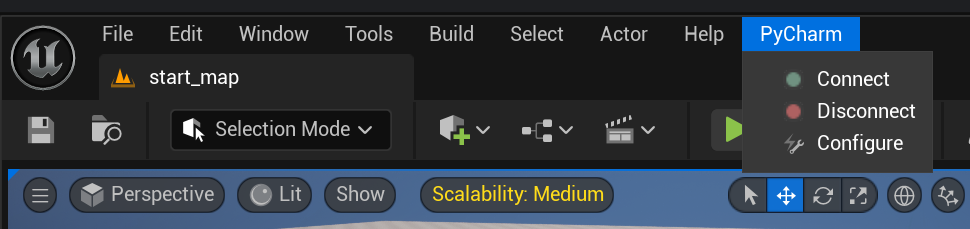
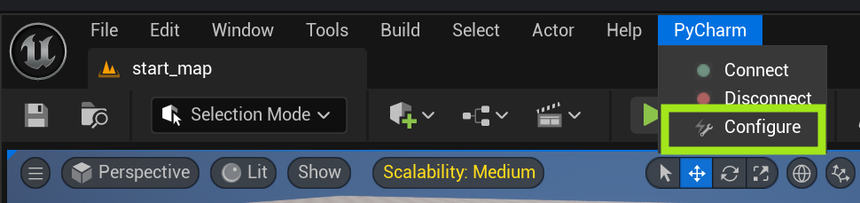
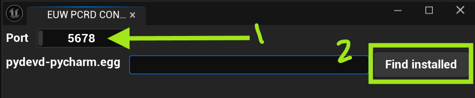
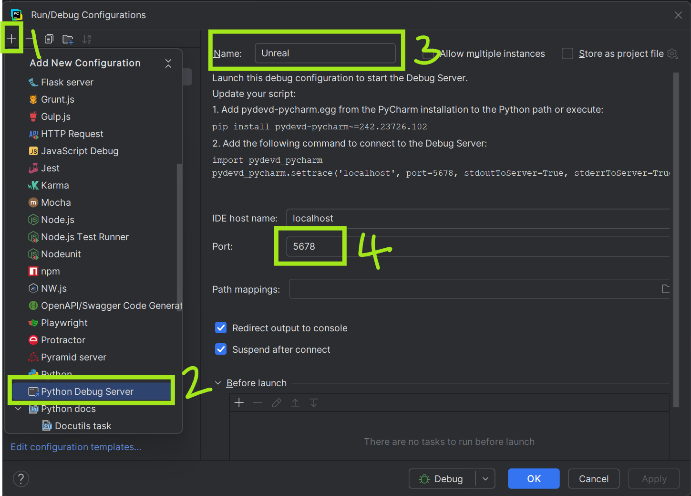
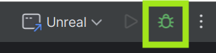
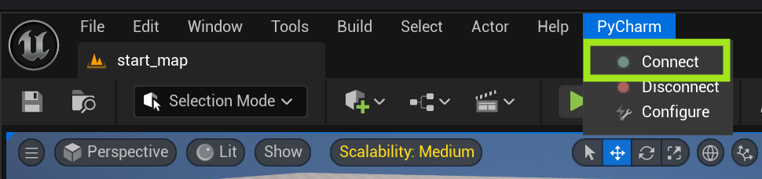
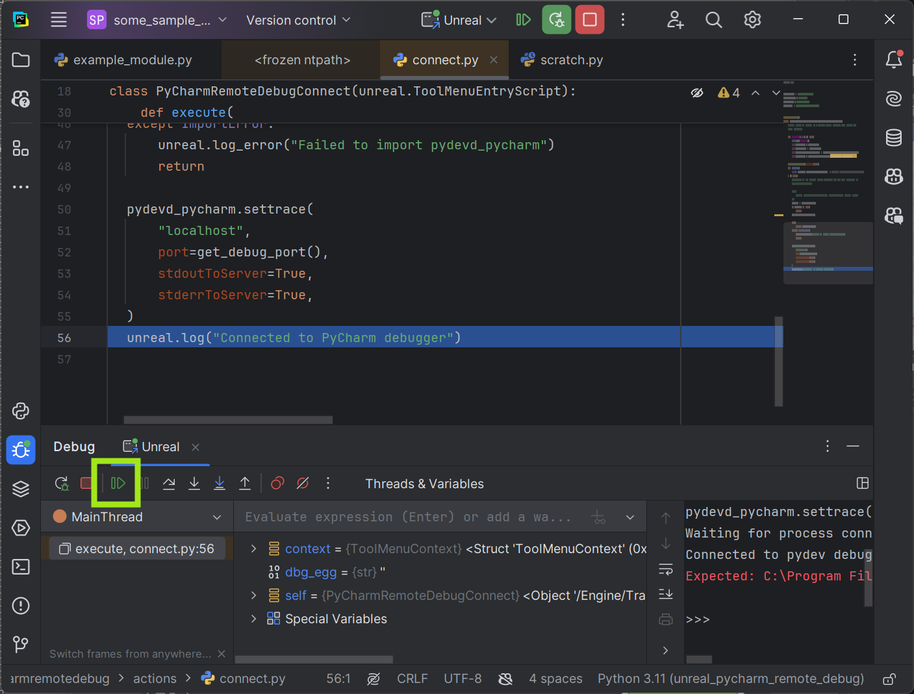

<!-- PROJECT SHIELDS -->

[![pytest][pytest-shield]][pytest-url]

<!-- PROJECT LOGO -->
 
  

[![Python][python_3-shield]][python-url]
[![Unreal][unreal_5-shield]][unreal-url]

<h3 align="center">Unreal PyCharm Remote Debug</h3>
  An Unreal Engine plugin for connecting to a PyCharm remote debugger.
   
  

    <a href="https://github.com/mattdeform/unreal_pycharm_remote_debug">View Demo</a>
    ·
    <a href="https://github.com/mattdeform/unreal_pycharm_remote_debug/issues/new?labels=bug&template=bug-report---.md">Report Bug</a>
    ·
    <a href="https://github.com/mattdeform/unreal_pycharm_remote_debug/issues/new?labels=enhancement&template=feature-request---.md">Request Feature</a>
  

<!-- TABLE OF CONTENTS -->

  
Table of Contents

  <ol>
    <li>
      <a href="#about-the-project">About The Project</a>
    </li>
    <li>
      <a href="#getting-started">Getting Started</a>
      <ul>
        <li><a href="#prerequisites">Prerequisites</a></li>
        <li><a href="#installation">Installation</a></li>
        <li><a href="#usage">Usage</a></li>
      </ul>
    </li>
    <li><a href="#roadmap">Roadmap</a></li>
    <li><a href="#contributing">Contributing</a></li>
    <li><a href="#license">License</a></li>
    <li><a href="#contact">Contact</a></li>
    <li><a href="#acknowledgments">Acknowledgments</a></li>
  </ol>

<!-- ABOUT THE PROJECT -->
## About The Project
<b>This is NOT an official JetBrains or Epic Games plugin, just a small utility I built for myself that I figured others might find useful.</b>

    

(<a href="#readme-top">back to top</a>)

<!-- GETTING STARTED -->
## Getting Started

### Prerequisites

* [Unreal 5.4.0](https://www.unrealengine.com)
* [PyCharm Professional](https://www.jetbrains.com/pycharm/buy/)

(<a href="#readme-top">back to top</a>)

### Installation

1. [Download the plugin and "Add to My Library"](https://www.fab.com/). <!--   1. TODO: add proper link when live -->
2. Add PyCharm Remote Debug plugin to your project of choice from the Unreal launcher Fab library. <!-- TODO: add pic when live -->
3. Open the project and in the level editor you should have a new menu named "PyCharm", select Configure
   1. 

(<a href="#readme-top">back to top</a>)

<!-- USAGE EXAMPLES -->
### Usage

1. You can configure port number and debug egg file location (comes with PyCharm installation) by clicking on the PyCharm -> Configure menu. 
    1. 
2. Select desired port number, and click "Find installed" to find the systems installed PyCharm. Alternatively you can manually enter a path to a desired pydevd-pycharm.egg file.
   1. 
3. In PyCharm, create a new Python Debug Server named <b>Unreal</b>, with the port number set in the previous step.
   1. 
4. In PyCharm click the Unreal debug icon.
   1. 
5. From the level editor click PyCharm -> Connect. <i>This will freeze your Unreal session until the next step (or timeout)</i> 
   1. 
6. Switch back over to PyCharm and click "Resume Program" or press F9 
   1. 
    
PyCharm is now connected to Unreal, you can set break points in your code and interactively debug your Python tools at runtime, enjoy!

> Note: Sometimes remote debug sessions can hang or become unstable. If this happens you can simply click the "Disconnect" button in Unreal and then start from step 4 again.
    

(<a href="#readme-top">back to top</a>)

<!-- ROADMAP -->
## Roadmap

See the [open issues](https://github.com/mattdeform/unreal_pycharm_remote_debug/issues) for a full list of proposed features (and known issues).

(<a href="#readme-top">back to top</a>)

## Contributing
If you have a suggestion that would make this better, please open an issue from the [request a feature](https://github.com/mattdeform/unreal_pycharm_remote_debug/issues/new?labels=enhancement&template=feature-request---.md) or [report a bug](https://github.com/mattdeform/unreal_pycharm_remote_debug/issues/new?labels=bug&template=bug-report---.md) pages.

Development and contribution guidelines can be found on the [CONTRIBUTING.md](CONTRIBUTING.md) page

<!-- LICENSE -->
## License

Distributed under the `insert_license_name` license. See `LICENSE` file for more information.

(<a href="#readme-top">back to top</a>)

<!-- CONTACT -->
## Contact

Please reach out via the [request a feature](https://github.com/mattdeform/unreal_pycharm_remote_debug/issues/new?labels=enhancement&template=feature-request---.md) or [report a bug](https://github.com/mattdeform/unreal_pycharm_remote_debug/issues/new?labels=bug&template=bug-report---.md) pages.

(<a href="#readme-top">back to top</a>)

<!-- ACKNOWLEDGMENTS -->
## Acknowledgments
* Project template by [TechArtOps](https://www.techartops.com).

(<a href="#readme-top">back to top</a>)

<!-- MARKDOWN LINKS & IMAGES -->
<!-- https://www.markdownguide.org/basic-syntax/#reference-style-links -->

<!-- Python -->
[python-shield]: https://img.shields.io/badge/python-3670A0?logo=python&logoColor=ffdd54
[python_2-shield]: https://img.shields.io/badge/Python-2.X-grey?logo=python&logoColor=ffdd54&labelColor=%233670A0
[python_3-shield]: https://img.shields.io/badge/Python-3.X-grey?logo=python&logoColor=ffdd54&labelColor=%233670A0
[python-url]: https://python.org/
[pytest-shield]: https://img.shields.io/badge/tests-pytest-%230A9EDC
[pytest-url]: https://docs.pytest.org/
[github-shield]: https://img.shields.io/badge/GitHub-%23181717?logo=github
[github-url]: https://github.com/
[github-actions-shield]: https://img.shields.io/badge/GitHub%20Actions-%232671E5?logo=githubactions&logoColor=white
[github-actions-url]: https://github.com/features/actions

[unreal_5-shield]: https://img.shields.io/badge/Unreal%20Engine-5.x-grey?logo=unrealengine&labelColor=%230E1128
[unreal-url]: https://www.unrealengine.com/en-US
